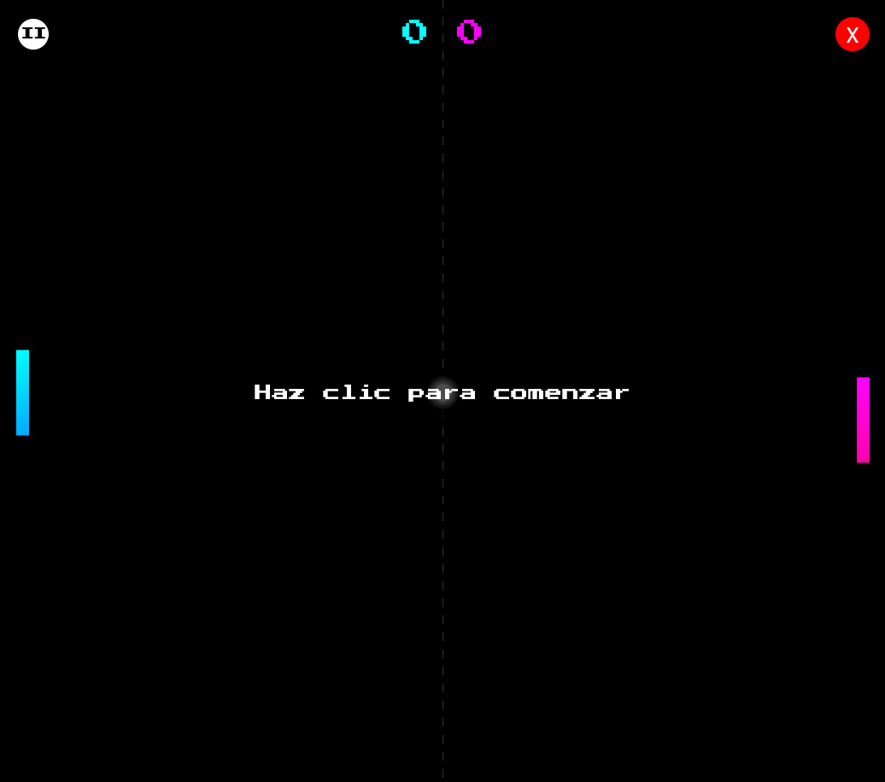

# 🎮 Pong Rally

Un juego estilo Pong con temática moderna, desarrollado con **JavaScript, HTML y CSS**.  
Inspirado en el clásico Pong, pero con un toque más dinámico y vistoso.

## 🚀 Demo

## 📸 Captura de Pantalla

## 🛠️ Tecnologías usadas
- **HTML5**
- **CSS3**
- **JavaScript**

## ✨ Características
- 🎨 Estilo retro con colores modernos.  
- 🕹️ Mecánicas clásicas de Pong.  
- 📱 Adaptable a distintos tamaños de pantalla.  

## 📂 Estructura del proyecto
### PongRally/
### │── index.html
### │── style.css
### ├── script.js  
### ├── assets/ (Imágenes, iconos SVG)  
### └── README.md  

## 📝 Licencia

MIT License - Libre para usar, modificar y compartir

## 💡 Pro Tip:
- La IA del modo **VS Máquina** predice la posición futura de la pelota calculando el tiempo hasta la paleta derecha y proyectando su **eje Y**; luego aplica **umbral de reacción**, **velocidad de respuesta**, **predicción** y **margen de error** distintos para **Fácil/Medio/Difícil**, para que no sea perfecta.
- La pelota acelera ~**5%** en cada rebote y se **limita** a una velocidad máxima para mantener el juego intenso pero controlable.
- Efectos visuales: **estela** de la pelota con historial de posiciones y **partículas** en colisiones; HUD con **marcador animado**; **audio en Base64** para golpes, punto y victoria; controles **teclado** y **táctiles** por lado de pantalla.

## 🚧 Próximas Mejoras:
✨ Más efectos de sonido arcade y música 8-bit  
✨ Guardar récords, dificultad y modo preferido en LocalStorage  
✨ Mejorar precisión de colisiones y límites (paletas/pelota)  

## ⭐ ¿Te gustó el proyecto?
¡Dejá una estrella en GitHub y compartilo! Este juego es mi forma de combinar **creatividad** y **programación** con estética retro.

# ¡Gracias por jugar Pong Rally! 🏓🚀
